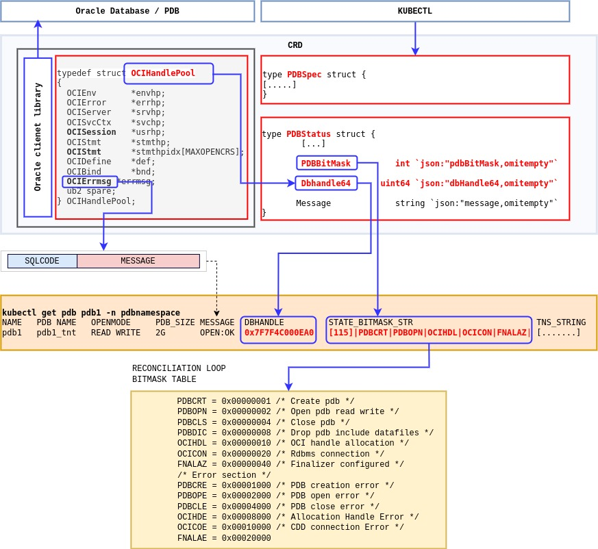
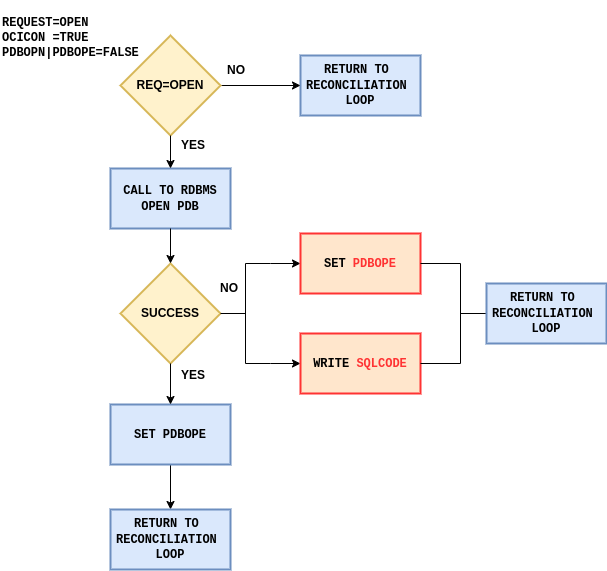

<span style="font-family:Liberation mono; font-size:0.8em; line-height: 1.2em">

# pdboperator

PDB controller for Oracle Pluggable Database Life Cycle Management 

## Description

This repository contains an **experimental** and **unsupported** version of [Oracle Pluggable Database Lice Cycle Management](https://github.com/oracle/oracle-database-operator) controller for kubernetes which provides a very limited set of functionalities (Create/Open/Close/Drop). The standard architecture (Oracle Database Operator for kubernetes) uses two kinds of resources: the pods which hosts the rest server and the PDB/CRD. The rest server is a proxy between the database and the PDB/CRD. In this configuration there is no need to use a proxy since the PDB/CRD connects directly to the Oracle Database by linking the Oracle Client Library on the manager pod. 

## Getting Started

### Prerequisites

The operator controller has been developed and tested with the following configuration  

- go version v1.23.3
- podman version 4.9.4-rhel
- kubectl version v1.28.3
- kubebuilder version 4.5.2
- OKE cluster version
- gcc version 8.5.0
- ld  version 2.30-125.0.1.el8_10
- GNU Make 4.2.1
- Oracle Client rpms: (local operator execution **make install run**) 
    - oracle-instantclient-release-el8-1.0-2.el8.x86_64
    - oracle-instantclient-basic-21.13.0.0.0-1.el8.x86_64
    - oracle-instantclient-devel-21.13.0.0.0-1.el8.x86_64

### To Deploy on the cluster

- **Build and push your image to the location specified by `IMG`**
- **Install the CRDs into the cluster**
- **Deploy the Manager to the cluster with the image specified by `IMG`:**

```sh
make generate manifests install docker-build IMG==<some-registry>/pdboperator:tag
make deploy IMG=<some-registry>/pdboperator:tag
```
>**NOTE:** This image ought to be published in the personal registry you specified.
And it is required to have access to pull the image from the working environment.
Make sure you have the proper permission to the registry if the above commands don’t work.

> **NOTE**: If you encounter RBAC errors, you may need to grant yourself cluster-admin privileges or be logged in as admin.

### Namespace Scoped and Cluster Scoped deployment 

Refer to the [Oracle Operator documentation](https://github.com/oracle/oracle-database-operator/?tab=readme-ov-file#create-role-bindings-for-access-management)  to configure a namespace or a cluster scope deploymenent. Exactly as is the standard procedure update the **WATCH_NAMESPACE** variable before deploy it.

### CRD Deployment
**Yaml file quick configuration**

In order to quickly configure the yaml files with your system parameters go to the directory [yaml_examples](./yaml_samples/) and  edit the [parameters.txt](./yaml_samples/parameters.txt). 
After that execute the command  `make genyaml` to generate the yaml files to creates two PDBS (pdb1_tnt ,pdb2_tnt) on the same CBD

|Parameter                                                      |Value|
|---------------------------------------------------------------|-----|
|TNSSTR|CDB tns string |
|SYSUSR|CDB administrative user with sysdba privilege|
|SYSPWD|CDB admin user password|
|PDBUSR|PDB admin user |
|PDBPWD|PDB admin user password|
|PDB_NAMESPACE|Namespace used for CRD - `pdbnamespace` in the examples|
|OPERATOR_NAMESPACE|pdboperator-system (do not edit)|
|FILECONVERSIONPATH1| 1st file name conversion for non ASM| 
|FILECONVERSIONPATH2| 2nd file name conversion for non ASM| 

- Record format : `PARAMETER`:`VALUE`
- TNSSTR example :(DESCRIPTION=(CONNECT_TIMEOUT=90)(RETRY_COUNT=30)(RETRY_DELAY=10)(TRANSPORT_CONNECT_TIMEOUT=70)(LOAD_BALLANCE=ON)(ADDRESS=(PROTOCOL=TCP)(HOST=scan12.testrac.com)(PORT=1521)(IP=V4_ONLY))(LOAD_BALLANCE=ON)(ADDRESS=(PROTOCOL=TCP)(HOST=scan34.testrac.com)(PORT=1521)(IP=V4_ONLY))(CONNECT_DATA=(SERVER=DEDICATED)(SERVICE_NAME=TESTORDS)))
- 1st File conversion format `path`,`pdb1_tnt`
- 2nd File conversion format `path`,`pdb2_tnt`

#### Secret creation

Apply file [sys_secrets.yaml](./yaml_samples/sys_secrets.yaml) and [pdb_secrets.yaml](./yaml_samples/pdb_secrets.yaml)

```bash
# Apply secrets file
kubectl apply -f pdb_secrets.yaml 
kubectl apply -f sys_secrets.yaml

kubectl get secrets -n pdbnamespace 
NAME        TYPE                DATA   AGE
pdbsecret   Opaque              2      7d2h
syssecret   Opaque              2      7d23h
```
#### Operator deployment

```bash
kubectl apply -f pdboperator.yaml

#Check pod status
kubectl get pod -n pdboperator-system
NAME                                              READY   STATUS    RESTARTS   AGE
pdboperator-controller-manager-5d9c98997c-dvmcw   1/1     Running   0          35s

```
#### First PDB creation

Apply [pdb_sample_01.yaml](./yaml_samples/pdb_sample_01.yaml)

```bash
kubectl apply -f pdb_sample_01.yaml
```

```bash
## execution output ###
kubectl wait  --for jsonpath='{.status.openMode}'="MOUNT" pdb pdb1 -n pdbnamespace  --timeout=3m
pdb.database.oracle.com/pdb1 condition met

kubectl get pdb -n pdbnamespace 
NAME   PDB NAME   OPENMODE   PDB_SIZE   MESSAGE     DBHANDLE         STATE_BITMASK_STR                    CONNECT_STRING
pdb1   pdb1_tnt   MOUNT      2G         CREATE:OK   0x7F7F4C000EA0   [113]|PDBCRT|OCIHDL|OCICON|FNALAZ|   (DESCRIPTION=(CONNECT_TIMEOUT=90)...
```
#### Open PDB 

```bash
kubectl patch pdb pdb1 -n pdbnamespace  -p '{"spec":{"pdbState":"OPEN"}}' --type=merge
```
```bash
### execution output ###
kubectl wait  --for jsonpath='{.status.openMode}'="READ WRITE" pdb pdb1 -n pdbnamespace  --timeout=3m
pdb.database.oracle.com/pdb1 condition met

kubectl get pdb -n pdbnamespace 
NAME   PDB NAME   OPENMODE     PDB_SIZE   MESSAGE   DBHANDLE         STATE_BITMASK_STR                           CONNECT_STRING
pdb1   pdb1_tnt   READ WRITE   2G         OPEN:OK   0x7F7F4C000EA0   [115]|PDBCRT|PDBOPN|OCIHDL|OCICON|FNALAZ|   (DESCRIPTION=(CONNECT_....
```

#### Close PDB

```bash
kubectl patch pdb pdb1 -n pdbnamespace  -p '{"spec":{"pdbState":"CLOSE"}}' --type=merge
```

```bash
### execution outeput ###
kubectl wait  --for jsonpath='{.status.openMode}'="MOUNT" pdb pdb1 -n pdbnamespace  --timeout=3m
pdb.database.oracle.com/pdb1 condition met

kubectl get pdb -n pdbnamespace 
NAME   PDB NAME   OPENMODE   PDB_SIZE   MESSAGE    DBHANDLE         STATE_BITMASK_STR                           CONNECT_STRING
pdb1   pdb1_tnt   MOUNT      2G         CLOSE:OK   0x7F7F4C000EA0   [117]|PDBCRT|PDBCLS|OCIHDL|OCICON|FNALAZ|   (DESCRIPTION=(CONNECT_TIMEOUT....
```

#### Delete PDB 

```bash
kubectl delete pdb pdb1 -n pdbnamespace
```

### To Uninstall

- **Delete the APIs(CRDs) from the cluster:**
- **UnDeploy the controller from the cluster:**

```bash
cd pdboperator
make uninstall
make undeploy
```

### Technical Detals

By leveraging on the option **GCO_LANG=1** the operator links the Oracle Client Library which enables the capability of opening a direct connecion to the CDB database. All the client hanldes are wrapped into the OCIHandlePool struct whose address is exposed in the Status CRD struct. The operator [Dockerfile](./Dockerfile) contains all the directives to link the libclient library.



Requests are managed in the reconciliation loop by using the status bitmask. See for example the flow chart of the open request in the reconciliation loop.



## Contributing

## Reporting a Security Issue

See [Reporting security vulnerabilities](https://github.com/gotsysdba/oracle-ords-operator/blob/main/SECURITY.md)

## License

Copyright (c) 2024 Oracle and/or its affiliates. Released under the Universal Permissive License v1.0 as shown at https://oss.oracle.com/licenses/upl/

<span/>
